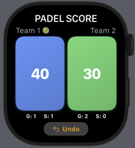

# PadelScorer 🏓

<div align="center">
  
  <br>
  <em>Keep score effortlessly on your wrist</em>
</div>

## 🎯 About

PadelScorer is a sleek Apple Watch app designed to make scorekeeping during padel matches as effortless as the sport itself. Born from the frustration of constantly losing track of scores during intense rallies, this app brings tennis-style scoring right to your wrist with haptic feedback and intuitive design.

## 💡 Motivation

As someone who recently discovered the addictive world of padel, I quickly realized that keeping track of the score can be surprisingly challenging when you're caught up in the excitement of the game. Traditional scoreboards are clunky, phones are impractical during play, and relying on memory... well, let's just say that doesn't always work out.

The Apple Watch seemed like the perfect solution - always accessible, hands-free operation, and right there on your wrist. PadelScorer transforms your watch into a dedicated tennis scoring companion that never gets in the way of your game.

## ⚡ Features

### Current Functionality
- **Tennis-style scoring system** with proper deuce and advantage handling
- **Dual-team score tracking** with games and sets
- **Serving indicator** showing which team is currently serving
- **Haptic feedback** for score increments and game wins
- **Visual celebrations** with confetti animations for set wins
- **One-tap undo** functionality for accidental score changes
- **Game state management** with automatic serve switching
- **Optimized for Apple Watch** with large, easy-to-tap buttons

### Design Philosophy
- **Glanceable interface**: Score visible at a quick wrist turn
- **Large touch targets**: Easy to tap even during intense rallies
- **High contrast colors**: Blue and green teams for clear differentiation
- **Minimal distractions**: Clean, focused UI that doesn't overwhelm
- **Celebratory moments**: Visual feedback for achievements to enhance the experience

## 🏗️ Technical Architecture

### Built With
- **SwiftUI** for modern, declarative UI
- **WatchKit** for Apple Watch specific functionality
- **Combine** for reactive state management
- **iOS companion app** (currently minimal, ready for future expansion)

### Key Components
- `GameManager`: Core game logic and state management
- `ScoreCounterView`: Main scoring interface
- `TeamScoreView`: Individual team score display
- `ConfettiView`: Celebration animations
- `ResetGameView`: Game reset functionality

## 📱 Platform Support

- **Primary**: Apple Watch (watchOS)
- **Secondary**: iOS companion app (minimal implementation)

## 🚀 Future Roadmap

This section outlines the upcoming features and enhancements planned for PadelScorer, designed to evolve it into a comprehensive scoring and analytical platform for padel enthusiasts.

### 🎮 Core Game Features
- **Flexible Game Types**: Configure different match formats including various set-count options, traditional scoring vs. no-ad scoring, and tournament-style formats to accommodate different playing preferences
- **Advanced Game Timer**: Track match duration with detailed time analytics, including rally timing and break periods for comprehensive session management

### 📊 Data & Analytics
- **Score Persistence**: Save match history and statistics to view detailed game records in the iOS companion app, creating a personal padel database
- **Performance Analytics**: Advanced score analysis providing insights into playing patterns, win/loss ratios, and personalized areas for improvement based on match data
- **Match Statistics**: Track serving efficiency, point distribution, and game momentum to help players understand their strengths and weaknesses

### 📱 iOS Companion Features
- **Team Management**: Add, edit, and manage team names through the iOS companion app with custom player profiles and team configurations
- **Match History Browser**: Comprehensive interface to review past matches, compare performance over time, and share results
- **Social Features**: Share match results and achievements with the padel community

### 🏃‍♂️ Health & Fitness Integration
- **Movement Tracking**: Monitor player activity and movement patterns during matches using Apple Watch sensors
- **Heart Rate Integration**: Seamless integration with Apple HealthKit to track cardiovascular performance and fitness metrics during gameplay
- **Workout Sessions**: Register padel matches as official workouts in the Health app with calories burned and activity rings contribution

### 🔧 Enhanced User Experience
- **Voice Announcements**: Optional audio score announcements for hands-free score tracking
- **Customizable Themes**: Multiple color schemes and watch face complications for personalized experience
- **Tournament Mode**: Special features for organized tournaments including bracket management and multi-match tracking

*Have ideas for additional features? We'd love to hear your suggestions for making PadelScorer the ultimate padel companion!*

## 🛠️ Installation & Setup

1. Clone the repository:
   ```bash
   git clone https://github.com/Stowod/PadelScorer.git
   ```

2. Open `PadelScorer.xcodeproj` in Xcode

3. Select your Apple Watch as the target device

4. Build and run the project

## 🎮 How to Use

1. **Start a match**: The app opens with both teams at 0-0
2. **Score points**: Tap the colored team buttons to increment scores
3. **Track serving**: The padel ball indicator shows which team serves
4. **Undo mistakes**: Use the orange undo button for accidental taps
5. **Celebrate wins**: Enjoy the confetti when a team wins a set!
6. **Reset game**: Swipe to the second screen to reset the entire match

## 🤝 Contributing

This is a personal project, but suggestions and feedback are always welcome! Feel free to open issues or reach out with ideas for improvements.

## 📄 License

This project is available under the MIT License. See the LICENSE file for more details.

## 👨‍💻 Author

**Emilian Popp**
- Padel enthusiast and iOS developer
- Always looking to combine passion projects with practical solutions

---

*Made with ❤️ for the padel community*
